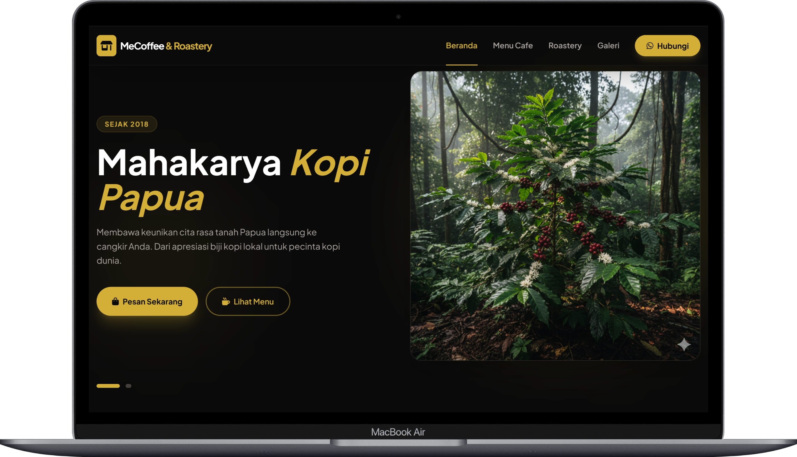
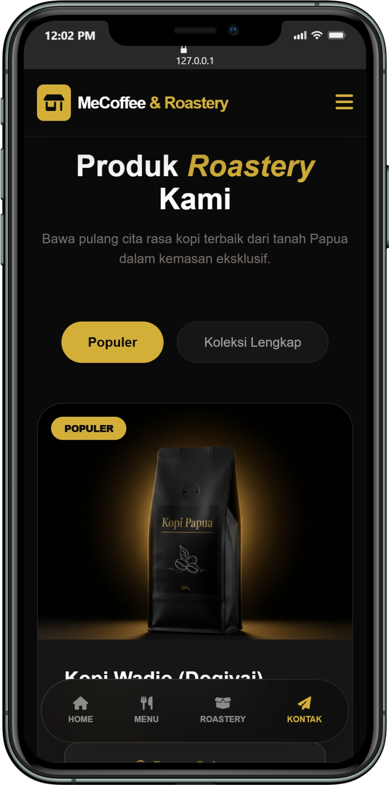
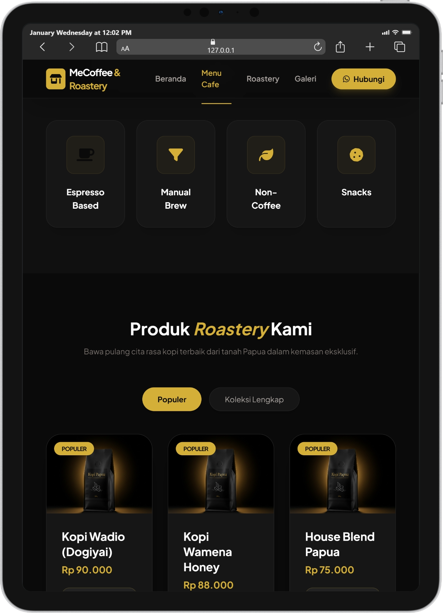

# Program 100 Website Gratis Nokensoft

## Demo Website MeCoffee & Roastery

Kunjungi di sini https://nokensoft-100-website-gratis.github.io/014-cafe-tana-papua/

### Mockup tampilan destop

### Mockup tampilan mobile

### Mockup tampilan tablet

## 1. Fitur Utama Website

- Hero Slider Interaktif: Menampilkan pesan utama (branding) tentang sejarah kopi Papua (sejak 2018) dan visi misi perusahaan dengan transisi visual yang modern.

- Katalog Menu Cafe: Pengelompokan produk yang jelas berdasarkan kategori (Espresso Based, Manual Brew, Non-Coffee, dan Snacks).

- Katalog Produk Roastery (E-Commerce Ready): Fitur tab untuk membedakan produk "Populer" dan "Koleksi Lengkap" biji kopi kemasan (Paniai, Wadio, Wamena, dll).

- Integrasi WhatsApp Direct: Tombol pemesanan yang langsung terhubung ke WhatsApp di setiap produk dan navigasi.

- Galeri Visual: Menampilkan sisi autentik kedai melalui foto-foto kegiatan dan produk.

- Informasi Lokasi & Maps: Detail alamat lengkap di Sentani, Jayapura, yang dilengkapi dengan Google Maps interaktif.

- Navigation Mobile Optimized: Bar navigasi khusus di bagian bawah untuk pengguna smartphone.

## 2. Manfaat Memiliki Website Ini

- Digital Branding yang Premium: Penggunaan warna emas (primary: #D4AF37) dan hitam pekat memberikan kesan mewah dan eksklusif bagi brand kopi Papua.

- Memperluas Jangkauan Pasar: Memungkinkan pelanggan dari luar Papua untuk melihat koleksi biji kopi (Roastery) dan memesannya secara online.

- Kredibilitas Bisnis: Website ini berfungsi sebagai profil profesional yang menunjukkan bahwa MeCoffee bukan sekadar kedai biasa, melainkan penyedia kopi yang mengedepankan kualitas lokal.

- Sentralisasi Informasi: Pelanggan tidak perlu bertanya satu per satu mengenai harga atau lokasi karena semua sudah tersaji dengan jelas.

## 3. Keunggulan Akses

- Kecepatan & Ringan: Menggunakan Tailwind CSS dan Alpine.js yang membuat website sangat cepat saat dimuat (load-time rendah).

- Responsive Design: Tampilan otomatis menyesuaikan antara komputer, tablet, dan HP.

- Scroll-Smooth & User Experience: Navigasi antar bagian terasa mulus, memudahkan pengunjung berpindah dari "Menu" ke "Kontak" tanpa memuat ulang halaman.

- Mobile-First Approach: Adanya floating navigation bar di bagian bawah saat dibuka di HP memberikan pengalaman seperti menggunakan aplikasi native.

## 4. Strategi Penggunaan Website

- Landing Page Iklan: Gunakan link website ini sebagai tujuan akhir iklan di Facebook atau Instagram. Arahkan audiens langsung ke bagian #roasting untuk konversi penjualan biji kopi.

- QR Code di Kedai: Tempelkan QR Code di meja cafe yang mengarah ke bagian #menu. Ini memudahkan pelanggan melihat daftar menu secara digital.

- Update Katalog Berkala: Manfaatkan bagian produk untuk menginfokan ketersediaan stok kopi musiman (misalnya kopi edisi terbatas dari pegunungan tertentu).

- Optimasi SEO Lokal: Karena website sudah menyertakan alamat lengkap di Sentani, ini akan membantu MeCoffee muncul di peringkat atas saat seseorang mencari "Kopi Papua terbaik" atau "Cafe di Sentani" di Google.

Powered by Nokensoft www.nokensoft.com

Digitalizing Papua's Potential, One Website at a Time.